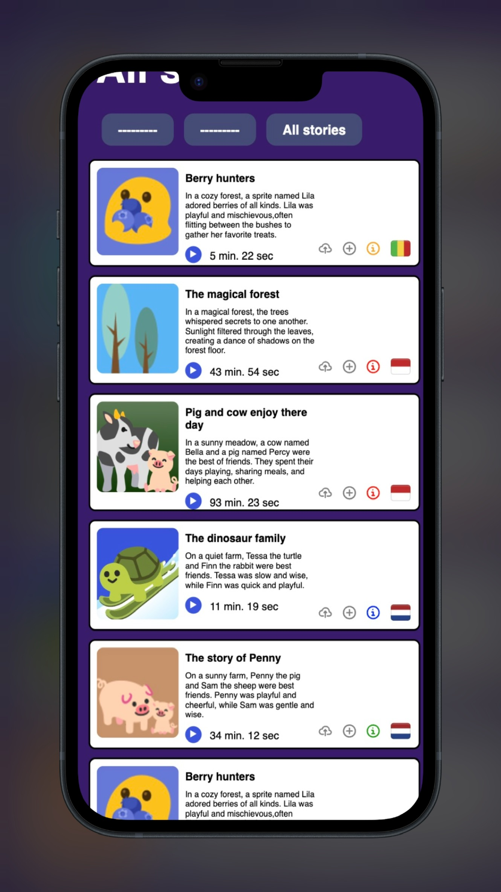

# Intro
Tumi-Mundo is een platform dat zich richt op het verbeteren en stimuleren van de taalontwikkeling van baby's van 6 maanden tot een jaar. Dit is belangrijk omdat een goede taalontwikkeling veel voordelen heeft, zoals het verbeteren van het leerproces, het verminderen van geestelijke gezondheidsproblemen en het vergroten van sociale vaardigheden.

Als schoolproject heb ik de opdracht gekregen van Tumi Mundo om de frontend van hun website te maken. Het algemene doel van dit project is om de aangeleverde ontwerpen en functionaliteiten te realiseren. Ik had de vrijheid om een ander design te kiezen en zelf te bepalen welke pagina of functionaliteit de meeste prioriteit kreeg.

https://github.com/Ravirkt/the-client-website  
https://github.com/Ravirkt/all-human-accessible-website  
https://github.com/Ravirkt/look-and-feel-corporate-identity

## Inhoudsopgave
- [Intro](#intro)
  - [Inhoudsopgave](#inhoudsopgave)
  - [Beschrijving](#beschrijving)
  - [Kenmerken](#kenmerken)
    - [HTMl-structuur](#html-structuur)
    - [CSS](#css)
    - [Javascript](#javascript)

## Beschrijving
In de vierde sprint heb ik me gefocust op het ontwerp van de lessons pagina en de all stories pagina. De lessons pagina is de pagina waarin de gebruiker een playlist kan aanmaken en een overzicht ziet van alle playlists. Ook bevat deze pagina een deel van de stories. De all stories pagina bevat een overzicht van alle stories die er op dit moment zijn. Op de pagina heb ik voornamelijk de feedback verwerkt die ik voorgaande sprint heb gekregen van de opdrachtgever.

## Kenmerken

### HTMl-structuur
Ik heb de standaard HTML-structuur gebruikt om de applicatie te bouwen. Dit maakt het makkelijk om te begrijpen en te onderhouden. Ik heb ervoor gezorgd dat alles goed is georganiseerd en logisch is. Ook heb ik gekeken naar toegankelijkheid voor iedereen door de WCAG-richtlijnen te volgen. Zo kunnen ook mensen met andere behoeftes, zoals gebruikers van schermlezers, de applicatie goed gebruiken. De pagina's zijn allemaal getest met de html validator, lighthouse test en handmatige tests.

### CSS
Voor de CSS heb ik me gefocust op zowel de layout als de styling van de applicatie. Ik heb ervoor gekozen om de basis van het ontwerp dicht bij de aangeleverde designs te houden, Tegelijkertijd heb ik mijn eigen ideeën toegevoegd om het ontwerp eigen te maken. Ook heb ik goed geluisterd naar de feedback die ik heb ontvangen van voorgaande sprints. Deze sprint heb ik ook gebruik gemaakt van een gezamelijke stylesheet dan mogelijk maakt om basis styling gezamelijk te houden.

### Javascript
In de lessons pagina heb ik javascript gebruikt voor een scrollfunctie. Deze functionaliteit was niet aanwezig in de aangeleverde design. Tijdens het testen van de gebruiksvriendelijkheid kwam ik erachter om dit te maken. De playlist cards worden naast elkaar weergegeven waardoor er een hele rij onstaat. Dit kan irritant zijn voor de gebruiker als je de laaste card wil bereiken. Met javascript heb ik een button gemaakt waarmee de gebruiker in een keer met een vloeiende beweging naar de meest recent gemaakte playlist (de laatste) wordt geleidt.

